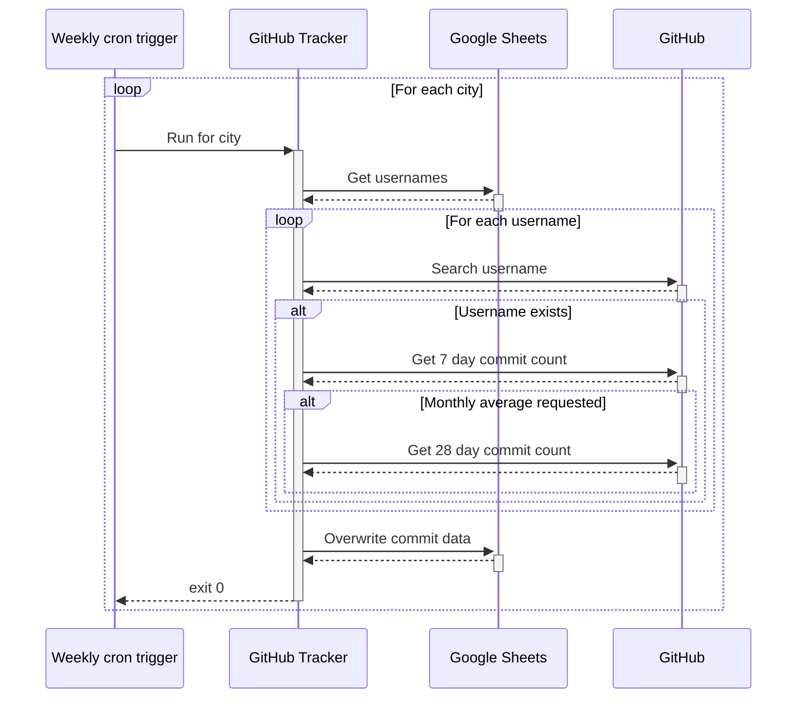

# GitHub Sheets

GitHub APIs and Google Sheets, together at last.

## Configuration

The following environment variables are required:

- `COMMIT_RANGE`: The range where the commits will be written.
- `GITHUB_TOKEN`: Token for accessing the GitHub APIs.
- `GOOGLE_CREDENTIALS`: Credentials required to access the Google Sheets API.
- `SPREADSHEET_ID`: The spreadsheet ID is shown in the sheet URL: `https://docs.google.com/spreadsheets/d/<here>/edit#gid=0`.
- `WORKSHEET_NAME`: The worksheet where the usernames will be listed.
- `USER_RANGE`: The range where the usernames will be listed.

The following configuration is optional:

- `AVERAGE_RANGE`: The range where the monthly average weekly commits will be written.
- `END_DATE`: Override the end date for the commit analysis (must be an ISO 8601 format string, e.g. `"2021-02-03"`).

## Production setup

It's assumed that the spreadsheet(s) to use will already exist, so we need to use the broader `"https://www.googleapis.com/auth/spreadsheets"` scope (which grants access to _all_ spreadsheets in the account) in production.

- Generate a project, OAuth app and `credentials.json` file as described in the [Google Developer docs].
- Run `npm run setup -- --production` to generate the appropriate credentials
- Set the `SPREADSHEET_ID`, `COMMIT_RANGE` and `USER_RANGE` as needed.

## Dev setup

For development purposes we can use the narrower `"https://www.googleapis.com/auth/drive.file"` scope, which only grants access to files the app has created, and automatically create the E2E test file.

- Clone the repo and run `npm ci` to install the dependencies.
- Create a [GitHub personal access token] and create a `.env` file containing it:
    ```bash
    GITHUB_TOKEN=<...>
    ```
- Generate a project, OAuth app and `credentials.json` file as described in the [Google Developer docs].
- Use `npm run setup` to generate the appropriate credentials and select the option to create a spreadsheet for you. This will output data to add to your `.env` file.
- Use `npm run ship` to ensure that the linting, type checks and tests pass.

### Refreshing credentials

If your credentials expire, you can recreate them _without_ creating a new spreadsheet by running `npm run setup` and selecting the appropriate option.

## Overview



[github personal access token]: https://docs.github.com/en/authentication/keeping-your-account-and-data-secure/managing-your-personal-access-tokens#creating-a-personal-access-token-classic
[google developer docs]: https://developers.google.com/sheets/api/quickstart/nodejs#set_up_your_environment
